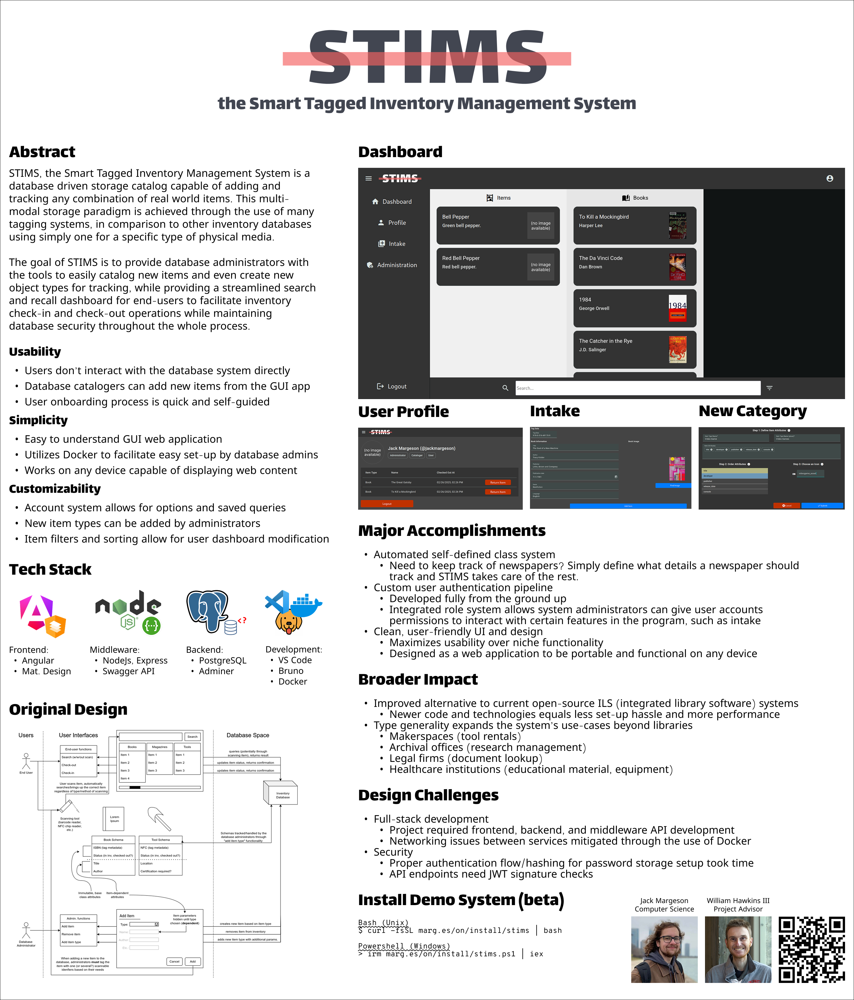

# STIMS: Smart Tagged Inventory Management Software

- [STIMS: Smart Tagged Inventory Management Software](#stims-smart-tagged-inventory-management-software)
  - [Project Abstract](#project-abstract)
  - [Team Information](#team-information)
  - [Project Planning](#project-planning)
    - [Goals and Description](#goals-and-description)
    - [User Stories](#user-stories)
    - [Design Diagrams](#design-diagrams)
      - [Design D0](#design-d0)
      - [Design D1](#design-d1)
      - [Design D2](#design-d2)
    - [Deliverables, Deadlines](#deliverables-deadlines)
      - [Task List](#task-list)
      - [Timeline](#timeline)
    - [ABET Concerns](#abet-concerns)
      - [Economic Constraints](#economic-constraints)
      - [Legal Constraints](#legal-constraints)
      - [Security Constraints](#security-constraints)
  - [User Interface Specification](#user-interface-specification)
  - [Test Plan and Results](#test-plan-and-results)
  - [User Manual](#user-manual)
  - [Spring Final PPT Presentation](#spring-final-ppt-presentation)
    - [PowerPoint Slides](#powerpoint-slides)
    - [Video](#video)
  - [CEAS Expo Poster](#ceas-expo-poster)
  - [Self-Assessment Reports](#self-assessment-reports)
    - [Initial self-assessments (Fall 2024)](#initial-self-assessments-fall-2024)
    - [Final self-assessments (Spring 2025)](#final-self-assessments-spring-2025)
  - [Summary of Expenses](#summary-of-expenses)
  - [Summary of Hours and Justification](#summary-of-hours-and-justification)
  - [Appendix](#appendix)
    - [Further Reading](#further-reading)

## Project Abstract

STIMS, the Smart Tagged Inventory Management System, is a database driven storage catalog capable of adding and tracking any combination of real world items. This multi-modal storage paradigm is achieved through the use of many tagging systems, in comparison to other inventory databases using simply one for a specific type of physical media.

The goal of STIMS is to provide database administrators with the tools to easily catalog new items and even create new object types for tracking, while providing a streamlined search and recall dashboard for end-users to facilitate inventory check-in and check-out operations while maintaining database integrity and security throughout the whole process.

## Team Information

**Jack Margeson**

5th year Computer Science

e: [margesji@mail.uc.edu](mailto:margesji@mail.uc.edu)

l: [linkedin.com/in/jack-margeson/](https://www.linkedin.com/in/jack-margeson/)

w: [marg.es/on](https://marg.es/on)

[Professional Biography](<Jack Margeson - Professional Biography.md>)

**Dr. William Hawkins III**

Asst Professor, Project Advisor

e: [hawkinwh@ucmail.uc.edu](mailto:hawkinwh@ucmail.uc.edu)

w: [researchdirectory.uc.edu/p/hawkinwh](https://researchdirectory.uc.edu/p/hawkinwh)

## Project Planning

### Goals and Description

The main area of focus for this project is creating and manipulating inventory databases to enable easy storage and retrieval of physical items through the implementation of a custom tagging system.

The project consists of a CRUD backend built in PostgreSQL and Node.js Express, with a front-end in Angular and TypeScript to utilize the power of inheritance to create different item structures. The Angular dashboard facilitates ease of use by end-users when performing database actions.

### User Stories

> "As a person in certain role, I want to meet a certain goal so that I have some tangible benefit.“

1. As a general user, I want to be able to search and check in/out items from the inventory so that I can easily keep track of my transactions and maintain accurate stock records.

2. As a database administrator, I want to be able to create new item types in the inventory database so that I can accurately categorize and track a wide range of items.

3. As a database administrator, I want to be able to assign different tagging systems to item entries so that I can easily retrieve and identify items using various identification methods (such as ISBN, NFC, RFID, etc.).

### Design Diagrams

#### Design D0

#### Design D1

#### Design D2

### Deliverables, Deadlines

#### Task List

For a status-updated task list, please view the [checklist](project_planning/Tasklist.md).

- Decide on object oriented language capable of interacting with database frameworks and also GUI creation
- Design user interface using sketches and prototyping
- Research database framework capable of handling schema with flexible types
- Create development environment for whatever language/framework chosen
- Implement GUI from sketched designs, both user and administrator roles
- Make generic classes as templates for future items to be added
- Provision space for database, test connectivity between programming language chosen and database
- Write member functions for template classes (add, remove, etc.)
- Link GUI elements to generic class member functions to test functionality
- Research types of items that warehouses/libraries would benefit from keeping track of
- Research libraries/methods for interpreting data from various scanners (barcode, NFC, RFID)
- Implement methods to handle data from multiple scanning interfaces
- Design classes that inherit the generic template class, incorporating scan data functions
- Refine GUI to reflect new functionality as well as refine visually
- Test program functionality (incl. scanning) in a mock real-world inventory scenario from the perspective of a database administrator
- Test program functionality (incl. scanning) in a mock real-world inventory scenario from the perspective of an end user

#### Timeline

This timeline has been created under the assumption that the final date for senior design project submissions is 05/01/2023. The time to complete milestones may scale up or down depending on the validity of this estimated end date.

### ABET Concerns

A summarized version of the ABET Concerns essay for this project is listed below. For more in-depth analysis, please view the [full essay](project_planning/assignment07_project_constraints_margesji.pdf).

#### Economic Constraints

Implementing tagging for the inventory system may require physical hardware, like NFC tags and scanners, which could be expensive. To mitigate this, I’ve proposed an alternative, cost-free tagging system where administrators can use unique serial codes and manual keyboard entry instead of specialized hardware.

#### Legal Constraints

Displaying item images, such as book covers or tools, in the database poses potential image licensing issues. To address this, I plan to allow administrators to upload their own images. This approach ensures that the images used in the system comply with copyright laws, as the administrators would own the rights to the photos.

#### Security Constraints

Managing a local database without proper access controls could create significant security risks. To prevent this, I’m designing a user identification system with defined roles. Administrators will have full access, while regular users will have restricted access, ensuring data integrity and security.

## User Interface Specification

To get acquainted with the user interface for the STIMS project, please see the embedded screenshots in the [user guide here](https://github.com/jack-margeson/stims/wiki/User-Guide).

## Test Plan and Results

The testing plan for the STIMS project and results can be found [here](project_planning/test_plan.pdf).

Endpoint tests performed on the middleware application have been saved and are accessible from this repository under `middleware/tests/STIMS`. These tests can be executed using the Bruno API client.

## User Manual

A user manual for the STIMS system has been created to onboard new users by assisting and documenting the installation process and general usage of the included features. The user manual is hosted on the project's GitHub page as a markdown wiki, which can be accessed [here](https://github.com/jack-margeson/stims/wiki/User-Guide).

## Spring Final PPT Presentation

### PowerPoint Slides

A presentation overview of the project is available in PowerPoint form [here](project_planning/assignment08_slideshow_margesji.pptx).

### Video

A narrated version of the project overview is available for download [here](project_planning/assignment08_presentation_margesji.mkv), or for viewing on my YouTube channel here: https://youtu.be/K8hqDVZwBLc

## CEAS Expo Poster

A higher quality, PDF version of the CEAS Expo poster can be found [here](project_planning/stims_expo_poster_41x48_f_vec.pdf).

## Self-Assessment Reports

A self assessment essay by each team member is listed below. This essay includes design choices and rationale for the project as a whole, as well as background information regarding skills utilized in the STIMS project.

### Initial self-assessments (Fall 2024)

Jack Margeson - [Self-assessment Essay](project_planning/assignment03_senior_design_margesji.pdf)

### Final self-assessments (Spring 2025)

Jack Margeson - [Self-assessment Essay](project_planning/assignment06_senior_design_margesji.pdf)

## Summary of Expenses

No expenses were incurred during the development of the STIMS project.

## Summary of Hours and Justification

Please note that no meeting notes are available, as the STIMS project was developed individually.

I, Jack Margeson, affirm that as of April 10th, 2025, I have dedicated and exceeded the required 45 hours to project planning, prototyping, and development efforts. An estimated 45 hours of project planning was performed by myself during the Fall 2024 semester, in addition to an estimated 50-60 hours of software development between October 8th, 2024 and April 6th, 2025. Please refer to the [commit history](https://github.com/jack-margeson/stims/commits/main/) of the STIMS repository for the timestamped development progress of the project.

## Appendix

Main repository (you are here): https://github.com/jack-margeson/stims

Built with [Bun](https://bun.sh/), a modern TypeScript development toolkit.

Gantt charts created with [onlinegantt.com](https://www.onlinegantt.com/).

### Further Reading

- [Docker documentation](https://docs.docker.com/)
- [Angular documentation](https://v17.angular.io/docs)
- [PostgresSQL documentation](https://www.postgresql.org/docs/)
- [Node.js documentation](https://nodejs.org/docs/latest/api/)
